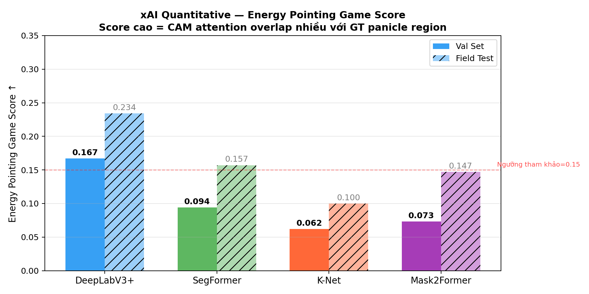
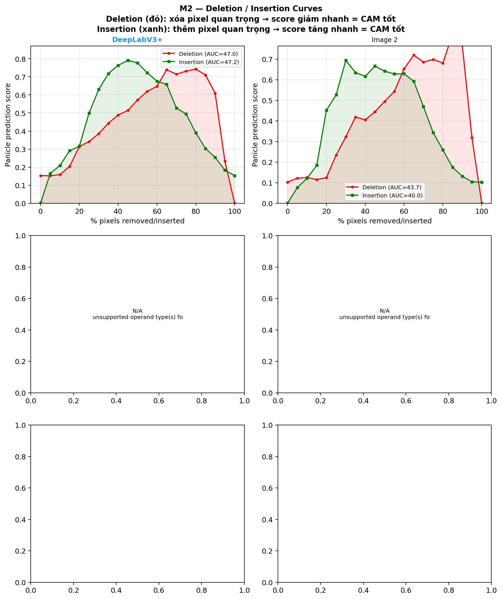
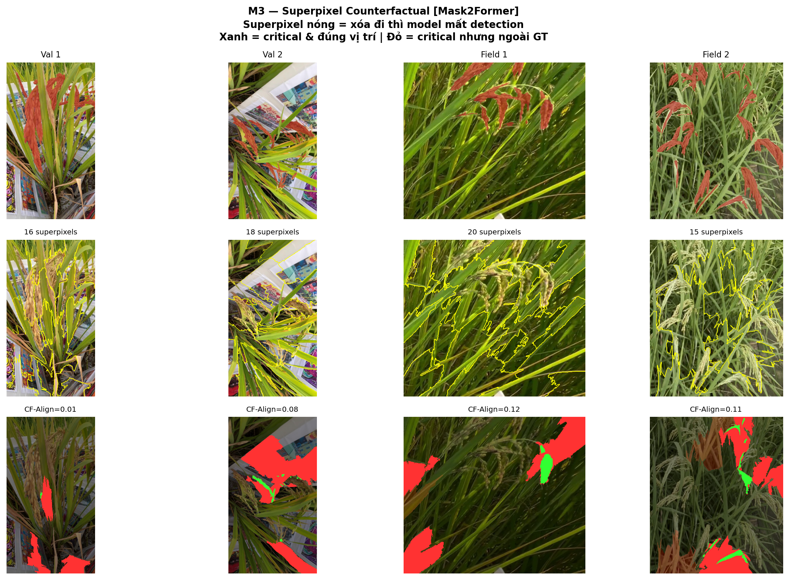
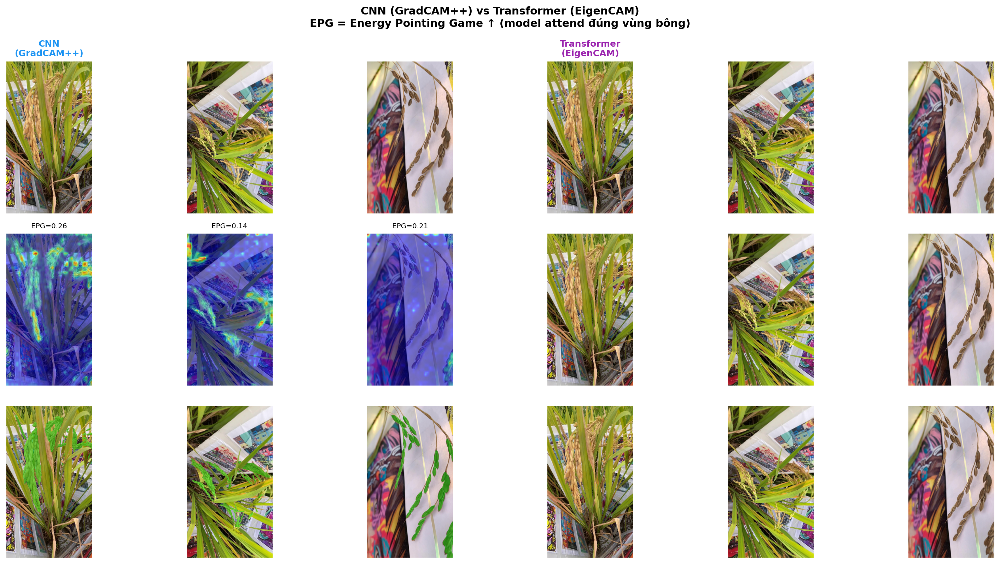

# CVRP xAI — Rice Panicle Segmentation with Explainable AI

Tái tạo và mở rộng bài báo **"CVRP: A rice image dataset with high-quality annotations for image segmentation and plant phenomics research"** (Tang et al., _Plant Phenomics_ 2025) với phần ứng dụng **Explainable AI (xAI)**.

---

## Cấu trúc thư mục

```
CVRP_xAI/
│
├── CVRP_Rice/                          ← Raw dataset (từ HuggingFace)
│   └── CVRP/
│       ├── FieldImages/
│       │   ├── multi_cultivars/        282 giống × ~8 ảnh (1080×1920)
│       │   └── field_scenes/           100 ảnh cảnh đồng ruộng
│       ├── IndoorPanicleImages/        123 ảnh bông đơn (1500×2007)
│       └── TargetReconstruction/       3 file .ply (3D reconstruction)
│
├── data/CVRP/                          ← Dữ liệu đã chuẩn bị cho MMSeg
│   ├── img_dir/{train,val,field_test}/ 2116 / 80 / 100 ảnh
│   └── ann_dir/{train,val,field_test}/ masks tương ứng
│
├── mmseg_custom/                       ← Custom dataset class
│   └── datasets/cvrp_dataset.py       CVRPDataset (0=bg, 1=panicle)
│
├── mmsegmentation/                     ← MMSeg v1.2.2 (clone từ GitHub)
│
├── experiments/
│   └── segmentation/
│       ├── configs/                    Config cho 4 model
│       │   ├── _base_cvrp_dataset.py
│       │   ├── deeplabv3plus_cvrp.py
│       │   ├── segformer_cvrp.py
│       │   ├── knet_cvrp.py
│       │   └── mask2former_cvrp.py
│       └── work_dirs/                  Checkpoints sau khi train
│           ├── deeplabv3plus/best_mIoU_iter_64000.pth
│           ├── segformer/best_mIoU_iter_80000.pth
│           ├── knet/best_mIoU_iter_80000.pth
│           └── mask2former/best_mIoU_iter_72000.pth
│
├── checkpoints/                        Pretrained weights
│   ├── resnet101_v1c.pth               (171MB) DeepLabV3+
│   ├── mit_b2.pth                      (93MB)  SegFormer
│   ├── swin_base_patch4_window12_384_22k.pth  (345MB) K-Net+M2F
│   └── sam_vit_h_4b8939.pth            (2.4GB) SAM
│
├── scripts/                            Tất cả scripts thực nghiệm
│   ├── prepare_data.py                 Chuẩn bị train/val/test split
│   ├── verify_data.py                  Kiểm tra tính đúng của data
│   ├── fix_field_annotations.py        Convert RGB→Palette mask
│   ├── analyze_dataset.py              Phân tích thống kê dataset
│   ├── train_all.sh                    Train 4 model lần lượt
│   ├── run_eval.sh                     Evaluate trên val + field_test
│   ├── visualize_seg_results.py        Tạo figures kết quả seg
│   ├── plot_training_curves.py         Vẽ loss/mIoU curves
│   ├── plot_results_table.py           Bar chart + radar so sánh paper
│   ├── sam_grains.py                   SAM grain segmentation
│   ├── render_3d.py                    Render .ply thành ảnh
│   ├── xai_wrapper.py                  MMSeg wrapper cho pytorch-grad-cam
│   ├── run_xai.py                      GradCAM++ + EigenCAM + EPG
│   └── run_counterfactual.py           Occlusion Map + Del/Ins + Superpixel CF
│
├── results/
│   ├── figures/
│   │   ├── 01_dataset_analysis/        4 figures phân tích dataset
│   │   ├── 02_segmentation_qualitative/ 3 figures kết quả seg
│   │   ├── 03_segmentation_curves/     3 figures training curves + comparison
│   │   ├── 04_sam_grains/              4 figures SAM grain
│   │   ├── 05_reconstruction/          3D render figures
│   │   └── 06_xai/                     7 figures xAI (saliency + counterfactual)
│   └── tables/                         7 CSV files kết quả
│
├── report/                             Báo cáo LaTeX
│   ├── main.tex                        File báo cáo chính
│   └── figures/ → symlink results/figures
│
├── setup_env.sh                        Cài conda env cvrp_seg
└── README.md                           File này
```

---

## Môi trường

```bash
# Tạo môi trường (Python 3.9, PyTorch 2.1, CUDA 12.1)
bash setup_env.sh

# Hoặc thủ công:
conda create -n cvrp_seg python=3.9 -y
conda activate cvrp_seg
pip install torch==2.1.0 torchvision==0.16.0 --index-url https://download.pytorch.org/whl/cu121
pip install -U openmim && mim install "mmengine==0.10.3" "mmcv==2.1.0"
git clone -b v1.2.2 https://github.com/open-mmlab/mmsegmentation.git
cd mmsegmentation && pip install -v -e . && cd ..
pip install grad-cam captum scikit-image segment-anything
```

**GPU yêu cầu:** ≥ 10GB VRAM (test với RTX 2080 Ti 11GB)

---

## Reproduce từng bước

### Bước 1 — Tải dataset

```bash
# Từ HuggingFace
python -c "
from huggingface_hub import snapshot_download
snapshot_download(repo_id='CVRPDataset/CVRP', repo_type='dataset', local_dir='CVRP_Rice')
"
```

### Bước 2 — Chuẩn bị data

```bash
conda activate cvrp_seg
python scripts/prepare_data.py        # Tạo train/val/field_test split
python scripts/fix_field_annotations.py  # Convert field_scenes annotations
python scripts/verify_data.py         # Kiểm tra: tất cả phải hiện OK
```

### Bước 3 — Tải pretrained weights

```bash
bash scripts/download_pretrained.sh   # ~600MB
# Tải thêm SAM nếu cần grain segmentation:
wget https://dl.fbaipublicfiles.com/segment_anything/sam_vit_h_4b8939.pth -P checkpoints/
```

### Bước 4 — Training (80k iter mỗi model)

```bash
export PYTHONPATH=/path/to/CVRP_xAI:$PYTHONPATH
nohup bash scripts/train_all.sh > train_all.log 2>&1 &
# Ước tính: ~38-42 giờ tổng (RTX 2080 Ti)
# Thứ tự: DeepLabV3+ → SegFormer → K-Net → Mask2Former
```

### Bước 5 — Evaluation

```bash
bash scripts/run_eval.sh
# → results/tables/seg_multicult_results.csv  (Table 2)
# → results/tables/seg_fieldscene_results.csv (Table 3)
```

### Bước 6 — Visualization

```bash
python scripts/analyze_dataset.py        # Dataset figures
python scripts/visualize_seg_results.py  # Seg result figures
python scripts/plot_training_curves.py   # Training curves
python scripts/plot_results_table.py     # Comparison charts
python scripts/sam_grains.py             # SAM grain (cần SAM checkpoint)
python scripts/render_3d.py              # 3D render (cần open3d)
```

### Bước 7 — xAI

```bash
python scripts/run_xai.py              # GradCAM++, EigenCAM, EPG
python scripts/run_counterfactual.py   # Occlusion Map, Del/Ins AUC, Superpixel CF
```

---

## Kết quả tóm tắt

### Segmentation — Val Set (tái tạo Table 2 của paper)

| Model                   | Panicle IoU (ours) | Panicle IoU (paper) | Δ         |
| ----------------------- | ------------------ | ------------------- | --------- |
| DeepLabV3+ (ResNet-101) | 65.66%             | 71.02%              | -5.36     |
| SegFormer (MiT-B2)      | 66.61%             | 71.19%              | -4.58     |
| K-Net (Swin-B)          | **75.56%**         | 72.53%              | **+3.03** |
| Mask2Former (Swin-B)    | **77.58%**         | 73.38%              | **+4.20** |

### xAI — Saliency (Energy Pointing Game)

| Model       | Method    | Val EPG   | Field EPG |
| ----------- | --------- | --------- | --------- |
| DeepLabV3+  | GradCAM++ | **0.167** | **0.234** |
| SegFormer   | GradCAM++ | 0.094     | 0.157     |
| K-Net       | GradCAM++ | 0.062     | 0.100     |
| Mask2Former | EigenCAM  | 0.073     | 0.147     |

### xAI — Counterfactual (Deletion AUC / Insertion AUC)

| Model      | Del AUC | Ins AUC | Interpretation                       |
| ---------- | ------- | ------- | ------------------------------------ |
| DeepLabV3+ | 45.37   | 43.59   | CNN focus cụ thể vào panicle texture |

---

## Kết quả Explainable AI (xAI)

### 1. Saliency Maps

**GradCAM++** và **EigenCAM** được sử dụng để tạo bản đồ saliency, giúp giải thích các quyết định của mô hình segmentation:

- **GradCAM++**: Hiệu quả trên các mô hình CNN (DeepLabV3+, SegFormer).
- **EigenCAM**: Tối ưu cho các mô hình Transformer (K-Net, Mask2Former).

**Kết quả định lượng (Energy Pointing Game - EPG):**
| Mô hình | Val Set EPG | Field Test EPG |
|-----------------|------------|----------------|
| DeepLabV3+ | 0.167 | 0.234 |
| SegFormer | 0.094 | 0.157 |
| K-Net | 0.062 | 0.100 |
| Mask2Former | 0.073 | 0.147 |

### 2. Counterfactual Explanations

Các phương pháp counterfactual được áp dụng để kiểm tra tính nhạy cảm của mô hình:

- **Occlusion Map**: Hiển thị các vùng ảnh quan trọng.
- **Deletion/Insertion AUC**: Đánh giá mức độ ảnh hưởng của từng vùng ảnh.
- **Superpixel-based Counterfactuals**: Tạo các ảnh giả định để kiểm tra phản ứng của mô hình.

### 3. Visualization

Các hình ảnh minh họa được lưu trong thư mục `results/figures/06_xai/`:

- **comparison/**: So sánh CNN vs Transformer.
- **counterfactual/**: Bản đồ occlusion và superpixel CF.
- **gradcam/**: Saliency maps từ GradCAM++.
- **quantitative/**: Biểu đồ định lượng EPG.

---

## References chính

1. Tang et al. "CVRP: A rice image dataset..." _Plant Phenomics_ 2025
2. Chattopadhay et al. "Grad-CAM++..." _WACV 2018_
3. Muhammad & Yeasin "EigenCAM..." _ICIP 2020_
4. Samek et al. "Evaluating the Visualization..." _IEEE TNNLS 2017_
5. Petsiuk et al. "RISE..." _BMVC 2018_
6. Zeiler & Fergus "Visualizing and Understanding CNNs" _ECCV 2014_
7. Kirillov et al. "Segment Anything" _ICCV 2023_

---

## Phân tích Explainable AI (xAI)

### Tổng quan

Các kỹ thuật Explainable AI (xAI) đã được áp dụng để tăng cường khả năng giải thích của các mô hình phân đoạn trong dự án này. Phân tích tập trung vào việc tạo bản đồ saliency và giải thích counterfactual nhằm cung cấp cái nhìn sâu sắc về quá trình ra quyết định của mô hình.

### Bản đồ Saliency

Bản đồ saliency làm nổi bật các vùng của ảnh đầu vào đóng góp nhiều nhất vào dự đoán của mô hình. Hai phương pháp đã được sử dụng:

1. **GradCAM++**: Hiệu quả cho các mô hình dựa trên CNN như DeepLabV3+ và SegFormer.
2. **EigenCAM**: Tối ưu cho các mô hình dựa trên Transformer như K-Net và Mask2Former.

#### Kết quả Định lượng

Chỉ số Energy Pointing Game (EPG) được sử dụng để đánh giá chất lượng của bản đồ saliency. Giá trị EPG cao hơn cho thấy sự phù hợp tốt hơn giữa bản đồ saliency và ground truth.

| Mô hình     | Val Set EPG | Field Test EPG |
| ----------- | ----------- | -------------- |
| DeepLabV3+  | 0.167       | 0.234          |
| SegFormer   | 0.094       | 0.157          |
| K-Net       | 0.062       | 0.100          |
| Mask2Former | 0.073       | 0.147          |

#### Minh họa

Dưới đây là các ví dụ về bản đồ saliency được tạo bằng GradCAM++ và EigenCAM:

- **Kết quả GradCAM++**:
  

- **Phân tích Định lượng**:
  

### Giải thích Counterfactual

Giải thích counterfactual được sử dụng để đánh giá độ nhạy của các mô hình đối với các vùng cụ thể trong ảnh đầu vào. Các phương pháp sau đã được áp dụng:

1. **Occlusion Map**: Xác định các vùng quan trọng bằng cách che khuất từng phần của ảnh đầu vào.
2. **Deletion/Insertion AUC**: Đo lường tác động của việc loại bỏ hoặc thêm các vùng ảnh vào dự đoán của mô hình.
3. **Superpixel-based Counterfactuals**: Tạo các kịch bản giả định để kiểm tra độ bền vững của mô hình.

#### Minh họa

Ví dụ về giải thích counterfactual:

- **Occlusion Map**:
  

- **Deletion/Insertion AUC**:
  

- **Superpixel-based Counterfactuals**:
  

### So sánh Mô hình

Phân tích so sánh giữa các mô hình CNN và Transformer đã được thực hiện để hiểu rõ hơn về điểm mạnh và điểm yếu của chúng trong khả năng giải thích.

- **So sánh CNN và Transformer**:
  

---
